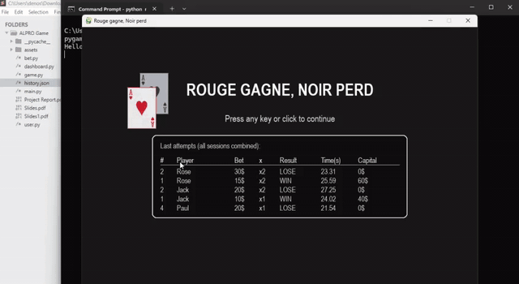

# CardGame — Rouge Gagne, Noir Perd

Interactive card-tracking and betting game developed with Python and Pygame.

The player follows a red card through a timed shuffle sequence and must identify its final position. The project combines object-oriented programming, event-driven game logic, state management, animation, audio feedback, player profiles, betting mechanics, and persistent game history.

## Live Game Demo



A full recorded gameplay session is also available in [`docs/cardgame_demo.mp4`](docs/cardgame_demo.mp4).

## Game Objective

Three cards are displayed at the beginning of each round:

- one red card,
- two black cards.

The player watches the cards, follows the red card during the shuffle animation, and then selects the card believed to be red.

A correct choice increases the player's balance. A wrong choice or timeout decreases it.

## Gameplay

Each round follows the same state-driven sequence:

```text
START
  ↓
PLAYER PROFILE
  ↓
BET SETUP
  ↓
SHOW CARDS
  ↓
SHUFFLE
  ↓
CHOOSE
  ↓
RESULT
  ├── Continue → BET SETUP
  └── Balance < minimum bet → GAME OVER
```

### Round Timing

- Card colors are visible for 10 seconds.
- The three cards are then shuffled for 10 seconds.
- The player has 10 seconds to select a card.
- Failure to choose before the timer expires counts as a loss.

## Betting System

The game starts with an initial player balance of **$30**.

The default betting configuration is:

| Parameter | Value |
| --- | ---: |
| Minimum bet | $10 |
| Maximum bet | $100 |
| Bet increment | $5 |
| Turbo multipliers | ×1, ×2, ×3 |

The effective stake is:

```text
stake = bet × turbo multiplier
```

If the selected card is red, the stake is added to the player's balance as profit.

If the selected card is black, or the selection timer expires, the stake is deducted from the balance.

The game ends when the player's balance becomes lower than the minimum allowed bet.

## Main Features

- Interactive Pygame user interface
- Player nickname and avatar selection
- Three-card red/black tracking game
- Animated random card shuffling
- Timed observation and selection phases
- Configurable betting amount
- Turbo multipliers ×1, ×2 and ×3
- Win, loss and shuffle sound effects
- Pause/resume with the `SPACE` key
- Per-round timing and statistics
- Persistent JSON game history
- Recent-session history displayed on the start screen
- Game-over summary

## Architecture

The project separates game logic into focused Python modules:

```text
main.py
  │
  ├── User
  │     └── player identity and balance
  │
  ├── Bet
  │     └── bet limits, amount and turbo multiplier
  │
  └── CardGame
        ├── state machine
        ├── cards and shuffle logic
        ├── timers
        ├── round resolution
        ├── history persistence
        └── Dashboard rendering
```

### State Machine

`CardGame` uses explicit states to control the game lifecycle:

```text
START_SCREEN
MENU
BET_SETUP
SHOW_BACKS
SHUFFLE
CHOOSE
RESULT
GAME_OVER
PAUSE
```

This keeps user input, update logic and rendering synchronized with the active phase of the game.

## Project Structure

```text
CardGame/
├── src/
│   ├── assets/
│   │   ├── avatar1.png
│   │   ├── avatar2.png
│   │   ├── avatar3.png
│   │   ├── card_back_black.png
│   │   ├── card_back_red.png
│   │   ├── card_front.png
│   │   ├── card_logo_back.png
│   │   ├── card_logo_front.png
│   │   ├── lose.mp3
│   │   ├── shuffle.mp3
│   │   └── win.mp3
│   ├── bet.py
│   ├── dashboard.py
│   ├── game.py
│   ├── main.py
│   └── user.py
├── data/
│   └── .gitkeep
├── docs/
│   ├── Report.pdf
│   ├── Game_Presentation.pptx
│   ├── cardgame_demo.gif
│   └── cardgame_demo.mp4
├── .gitignore
├── requirements.txt
└── README.md
```

`data/history.json` is created automatically while playing and is intentionally excluded from Git.

## Module Responsibilities

### `main.py`

Initializes Pygame, creates the player and betting objects, starts `CardGame`, and runs the main 60 FPS event/update/render loop.

### `game.py`

Contains the core game engine:

- card representation,
- state transitions,
- shuffle animation,
- timers,
- player selection,
- win/loss resolution,
- balance updates,
- pause handling,
- game statistics,
- JSON history persistence.

### `dashboard.py`

Contains the visual rendering functions for the different screens and overlays.

### `user.py`

Defines the player profile and manages the player's balance.

### `bet.py`

Defines betting limits, bet adjustment, turbo multipliers and effective stake computation.

## Installation

From the repository root:

```bash
cd Projects/CardGame
```

Create a dedicated virtual environment:

```bash
python3 -m venv .venv
source .venv/bin/activate
```

On Windows PowerShell:

```powershell
python -m venv .venv
.venv\Scripts\Activate.ps1
```

Install the dependency:

```bash
python -m pip install --upgrade pip
python -m pip install -r requirements.txt
```

## Run the Game

From `Projects/CardGame/`:

```bash
python src/main.py
```

The window opens at **960 × 630 pixels** and runs at **60 FPS**.

## Controls

| Action | Control |
| --- | --- |
| Continue from start screen | Any key or mouse click |
| Enter nickname | Keyboard |
| Select avatar | Mouse click |
| Change bet | `−` / `+` buttons |
| Select turbo | ×1 / ×2 / ×3 buttons |
| Start round | `START` button |
| Choose a card | Mouse click |
| Pause / resume | `SPACE` |
| Continue / return to menu / quit | On-screen buttons |

## Runtime History

Each completed round records information such as:

```text
round
player
bet
multiplier
stake
result
chosen card
red-card position
round duration
balance after round
timestamp
```

The history is saved locally to:

```text
data/history.json
```

The game keeps at most the 200 most recent entries.

## Documentation

The original academic documentation is preserved in `docs/`:

- [`Report.pdf`](docs/Report.pdf)
- [`Game_Presentation.pptx`](docs/Game_Presentation.pptx)

## Technologies

- Python
- Pygame
- Object-Oriented Programming
- Event-driven programming
- Finite-state game logic
- JSON persistence
- 2D animation
- Audio integration

## Participants

**Denos Kume**  
**Sena FUKABE**

**Supervisor:** Mira Rizkallah  
**Program:** M1 CORO DASSIP — École Centrale de Nantes  
**Academic Year:** 2025–2026
