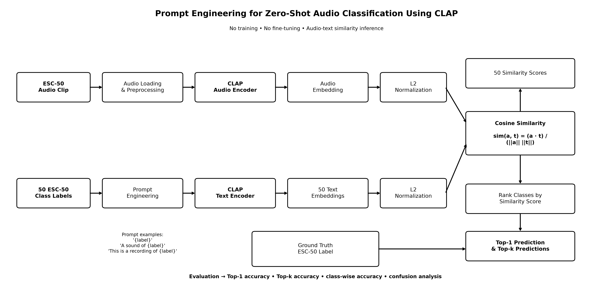

# Prompt Engineering for Unsupervised Audio Classification Using CLAP

Zero-shot environmental sound classification on ESC-50 using LAION-CLAP and prompt engineering.

This project investigates how text-prompt formulation affects CLAP zero-shot audio classification performance. Ten prompt templates are evaluated on the ESC-50 dataset without task-specific training or fine-tuning.

## Research Question

> How does prompt formulation influence CLAP zero-shot audio classification performance on the ESC-50 dataset?

## Objectives

The project implements a complete zero-shot audio classification workflow:

1. Download and inspect the ESC-50 dataset.
2. Load a pretrained LAION-CLAP model.
3. Define ten prompt strategies for the 50 ESC-50 classes.
4. Compute audio and text embeddings.
5. Apply L2 normalization to the embeddings.
6. Perform zero-shot classification using cosine similarity.
7. Benchmark Top-1 accuracy across prompt strategies.
8. Identify the best-performing prompt.
9. Analyze class-wise performance.
10. Compute Top-k accuracy from Top-1 to Top-10.
11. Compare class accuracy with AudioSet metadata.
12. Contextualize the zero-shot results against published ESC-50 classifiers.

## Method

For each prompt strategy, the 50 ESC-50 class labels are converted into natural-language prompts and encoded by CLAP's text encoder.

Each ESC-50 audio sample is independently processed by the CLAP audio encoder.

After L2 normalization, cosine similarity is computed between each audio embedding and the 50 text embeddings:

```text
ESC-50 Audio                         Prompt + Class Label
      │                                      │
      ▼                                      ▼
CLAP Audio Encoder                    CLAP Text Encoder
      │                                      │
      ▼                                      ▼
 Audio Embedding                       Text Embeddings
      │                                      │
      └──────────── L2 Normalization ─────────┘
                         │
                         ▼
                  Cosine Similarity
                         │
                         ▼
                50 Similarity Scores
                         │
                         ▼
                   Rank Classes
                         │
                         ▼
              Top-1 / Top-k Prediction
```

The evaluation is strictly **zero-shot**:

* no ESC-50 training,
* no task-specific fine-tuning,
* no classifier head trained on ESC-50.

### CLAP Zero-Shot Classification Pipeline



## Prompt Strategies

Ten prompt templates are evaluated:

```text
{}
a {}
the sound of {}
the sound of a {}
an audio recording of {}
a recording of the sound of {}
a sound clip of {}
this is the sound of {}
an environmental sound of {}
the sound of {} can be heard
```

The experiment measures how these different textual formulations influence alignment between audio and text representations.

## Project Structure

```text
Prompt_Engineering_Audio_Classification/
├── .venv/                         # local environment, not tracked
├── data/
│   └── ESC-50-master/             # downloaded locally, not tracked
├── notebooks/
│   └── Prompt_Engineering_Audio_Classification.ipynb
├── outputs/
│   ├── figures/
│   └── tables/
├── .gitignore
├── requirements.txt
└── README.md
```

The `.venv/` directory and downloaded ESC-50 dataset are local resources and are not tracked by Git.

## Notebook Structure

```text
0. Setup
1. Data and Output Paths
2. ESC-50 Dataset Preparation
3. Dataset Exploration
4. CLAP Model Initialization
5. Prompt Strategy Definition
6. Zero-Shot Classification Framework
7. Full Prompt Benchmark
8. Best Prompt and Class-wise Accuracy
9. Prompt Strategy Comparison
10. Class-wise Accuracy Summary
11. Main Benchmark Summary
12. Top-k Accuracy
13. AudioSet Metadata Analysis
14. Comparison with Published ESC-50 Classifiers
15. Results Summary

Discussion
Conclusion
Future Work
```

## Environment

The original experiment used LAION-CLAP with GPU acceleration in Google Colab.

The repository version uses a standard Python virtual environment and automatically selects CUDA when available; otherwise, inference runs on CPU.

The project has also been configured for execution under WSL Ubuntu using a dedicated virtual environment.

Direct dependencies are defined in `requirements.txt`:

```text
numpy==1.26.4
pandas==2.1.4
scipy==1.11.4
scikit-learn==1.3.2
torch
torchaudio
laion-clap
librosa==0.10.1
matplotlib
tqdm
requests
ipykernel
```

## Installation

From the project directory:

```bash
cd Projects/Prompt_Engineering_Audio_Classification
```

Create and activate the virtual environment:

```bash
python3 -m venv .venv
source .venv/bin/activate
```

Upgrade `pip`:

```bash
python -m pip install --upgrade pip
```

Install the required dependencies:

```bash
python -m pip install -r requirements.txt
```

Register the Jupyter kernel:

```bash
python -m ipykernel install \
  --user \
  --name prompt-engineering-audio-classification \
  --display-name "Prompt Engineering Audio Classification (.venv)"
```

## Running the Notebook

Open:

```text
notebooks/Prompt_Engineering_Audio_Classification.ipynb
```

Select the kernel:

```text
Prompt Engineering Audio Classification (.venv)
```

Then execute the notebook from top to bottom.

The notebook downloads ESC-50 automatically into `data/` if the dataset is not already available.

On the first execution, `model.load_ckpt()` may also download the pretrained CLAP checkpoint and associated model resources.

Generated tables are stored in:

```text
outputs/tables/
```

Generated figures are stored in:

```text
outputs/figures/
```

## Experimental Results

The prompt benchmark recorded the following Top-1 accuracies:

| Rank | Prompt Strategy       | Top-1 Accuracy |
| ---: | --------------------- | -------------: |
|    1 | Audio Recording       |     **91.15%** |
|    2 | Sound Clip            |         87.60% |
|    3 | Recording Sound       |         87.55% |
|    4 | A Class               |         87.00% |
|    5 | Heard Sound           |         85.10% |
|    6 | Sound Of A            |         84.90% |
|    7 | Sound Of              |         83.75% |
|    8 | This Is Sound         |         83.10% |
|    9 | Class Only (Baseline) |         83.05% |
|   10 | Environmental Sound   |         81.85% |

The best-performing prompt template was:

```text
an audio recording of {}
```

It achieved a Top-1 accuracy of **91.15%**, improving performance by **8.10 percentage points** over the class-only baseline.

This demonstrates that prompt formulation has a substantial effect on CLAP zero-shot classification performance.

## Top-k Accuracy

Using the best-performing prompt strategy:

| Metric |   Accuracy |
| ------ | ---------: |
| Top-1  | **91.15%** |
| Top-2  |     95.80% |
| Top-3  |     97.45% |
| Top-5  |     99.00% |
| Top-10 |     99.55% |

The strong increase from Top-1 to Top-5 indicates that the correct ESC-50 class is very frequently ranked among CLAP's highest-similarity text candidates.

## AudioSet Metadata Analysis

The study compares ESC-50 class-wise accuracy with AudioSet quality scores and class video counts across all 50 classes.

Recorded correlations:

| Comparison                         | Pearson r | Spearman ρ |
| ---------------------------------- | --------: | ---------: |
| Accuracy vs AudioSet Quality       |     0.081 |      0.107 |
| Accuracy vs log10(AudioSet Videos) |    -0.181 |     -0.066 |

These values indicate weak relationships between the investigated AudioSet metadata variables and ESC-50 zero-shot classification accuracy in this experiment.

## Comparison with Published ESC-50 Classifiers

The project also places the CLAP zero-shot result in context using external benchmark values recorded in the study:

| Method          | Model Type              |   Accuracy | Recomputed in This Project |
| --------------- | ----------------------- | ---------: | :------------------------: |
| BEATs           | Supervised / Fine-tuned |     98.61% |             No             |
| HTS-AT          | Supervised / Fine-tuned |     96.20% |             No             |
| AST             | Supervised / Fine-tuned |     95.30% |             No             |
| **CLAP (ours)** | **Zero-shot**           | **91.15%** |           **Yes**          |

The published classifier values are contextual references and are not recomputed by this project.

The comparison should therefore not be interpreted as a controlled head-to-head benchmark: the supervised systems use different training and evaluation protocols, whereas CLAP is evaluated here without ESC-50-specific training.

## Key Findings

The experiment highlights several observations:

* Prompt formulation materially affects zero-shot classification performance.
* The class-only prompt achieved 83.05% Top-1 accuracy.
* The best prompt, `an audio recording of {}`, achieved 91.15%.
* Prompt engineering therefore produced an improvement of 8.10 percentage points without modifying the CLAP model.
* Top-5 accuracy reached 99.00%.
* The investigated AudioSet metadata variables showed only weak correlations with class-wise ESC-50 accuracy.
* CLAP achieved competitive performance despite operating entirely in a zero-shot setting.

## Limitations

* Results depend on the specific pretrained CLAP checkpoint.
* Only ten manually designed prompt templates are evaluated.
* ESC-50 contains 2,000 audio samples across 50 classes and may not represent larger or more specialized audio domains.
* Prompt strategies are evaluated independently rather than through learned prompt optimization.
* The published-classifier comparison is not a controlled head-to-head experiment because the models use different training protocols.
* Full benchmarking is computationally expensive on CPU because every prompt strategy requires evaluation across the full ESC-50 dataset.
* Results may vary slightly across software versions, hardware configurations, and model checkpoints.

## Technologies

* Python
* PyTorch
* LAION-CLAP
* ESC-50
* NumPy
* pandas
* SciPy
* scikit-learn
* librosa
* Matplotlib
* Zero-shot learning
* Audio-text embeddings
* Prompt engineering
* Cosine similarity


## Participants

**Denos Kume**<br>
**Venkatesh Muthukrishnan**<br><br>

**Supervisor:** Modan Tailleur<br>
**Program:** M1 DASSIP — École Centrale de Nantes<br>
**Academic Year:** 2025–2026
