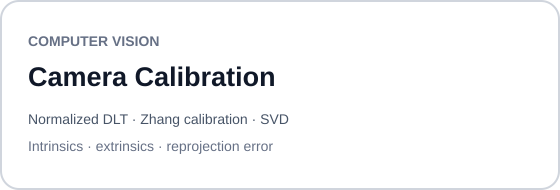
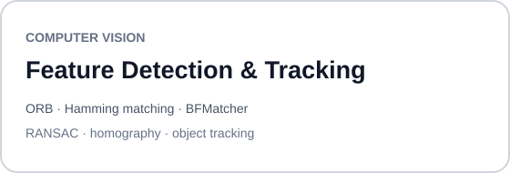
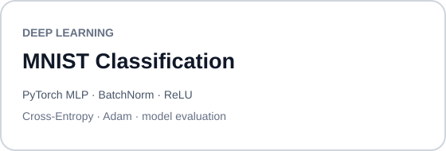
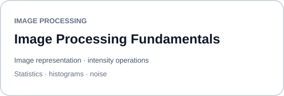
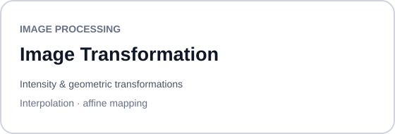
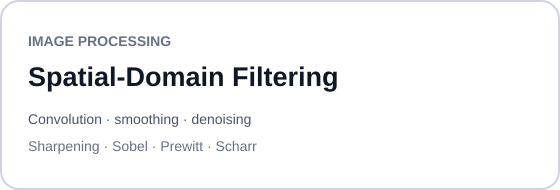
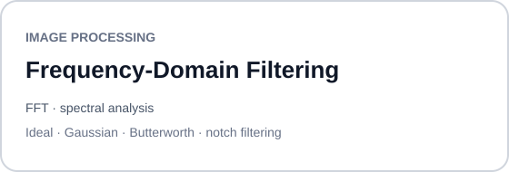
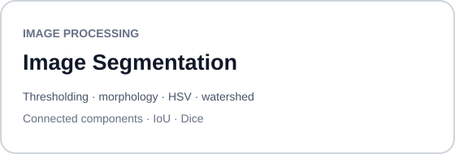
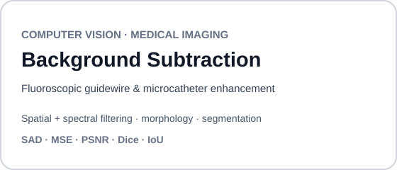
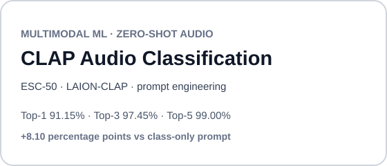

<p>
  
</p>
<p align="right"><strong>MSc. CORO DASSIP</strong></p>
<br clear="both">

<h1 align="center">MSc CORO DASSIP — Portfolio</h1>

This repository brings together laboratory modules in **Computer Vision, Image Processing, and Deep Learning**.

Each lab begins with a defined experimental objective, develops the relevant theory and assumptions, implements the required methods, and evaluates the results through quantitative measures, visual diagnostics, and validation checks.

All labs follow the same structure:

- **Problem Statement** — defines the experiment
- **Theory** — develops the required concepts and models
- **Requirements** — specifies the environment and data
- **Implementation** — contains the executable workflow, results, and analysis

Source data and generated figures are kept separate in `data/` and `outputs/`.

Beyond the code, the notebooks document the experimental reasoning: how methods and parameters are selected, how results are interpreted, which assumptions hold, and where limitations appear.

---

## Laboratory Work

### Computer Vision

<p align="center">
  <a href="labs/computer-vision/camera-calibration">
    
  </a>
  <a href="labs/computer-vision/feature-tracking">
    
  </a>
</p>

<p align="center">
  <a href="labs/computer-vision/deep-learning">
    
  </a>
</p>

### Image Processing

<p align="center">
  <a href="labs/image-processing/image-processing-fundamentals">
    
  </a>
  <a href="labs/image-processing/image-transformation">
    
  </a>
</p>

<p align="center">
  <a href="labs/image-processing/filtering-in-spatial-domain">
    
  </a>
  <a href="labs/image-processing/filtering-in-frequency-domain">
    
  </a>
</p>

<p align="center">
  <a href="labs/image-processing/segmentation">
    
  </a>
</p>

---

## Repository Structure

```text
msc-coro-dassip-portfolio/
├── labs/
│   ├── computer-vision/
│   │   ├── README.md
│   │   ├── camera-calibration/
│   │   ├── deep-learning/
│   │   └── feature-tracking/
│   │
│   └── image-processing/
│       ├── README.md
│       ├── filtering-in-frequency-domain/
│       ├── filtering-in-spatial-domain/
│       ├── image-processing-fundamentals/
│       ├── image-transformation/
│       └── segmentation/
├── .github/
│   └── workflows/
│       └── notebook-qa.yml
├── scripts/
│   └── validate_notebooks.py
├── .gitignore
└── README.md
```

---

## Projects

<p align="center">
  <a href="https://github.com/denoskume/Background-Subtraction-Fluoroscopy">
    
  </a>
  <a href="https://github.com/denoskume/CLAP-Zero-Shot-Audio-Classification">
    
  </a>
</p>

<p align="center">
  <a href="https://github.com/denoskume/Python-CardGame">
    
  </a>
</p>

---

## Tools and Libraries

<table align="center">
  <tr>
    <td align="center" width="100">
      <br>
      <sub><b>Python</b></sub>
    </td>
    <td align="center" width="100">
      <br>
      <sub><b>NumPy</b></sub>
    </td>
    <td align="center" width="100">
      <br>
      <sub><b>SciPy</b></sub>
    </td>
    <td align="center" width="100">
      <br>
      <sub><b>Matplotlib</b></sub>
    </td>
    <td align="center" width="100">
      <br>
      <sub><b>OpenCV</b></sub>
    </td>
  </tr>
  <tr>
    <td align="center" width="100">
      <br>
      <sub><b>PyTorch</b></sub>
    </td>
    <td align="center" width="100">
      <br>
      <sub><b>Jupyter</b></sub>
    </td>
    <td align="center" width="100">
      <br>
      <sub><b>VS Code</b></sub>
    </td>
    <td align="center" width="100">
      <br>
      <sub><b>Linux</b></sub>
    </td>
    <td align="center" width="100">
      <br>
      <sub><b>Git</b></sub>
    </td>
  </tr>
</table>

---

<p align="center">
  <a href="https://github.com/denoskume">
    
  </a>
</p>
